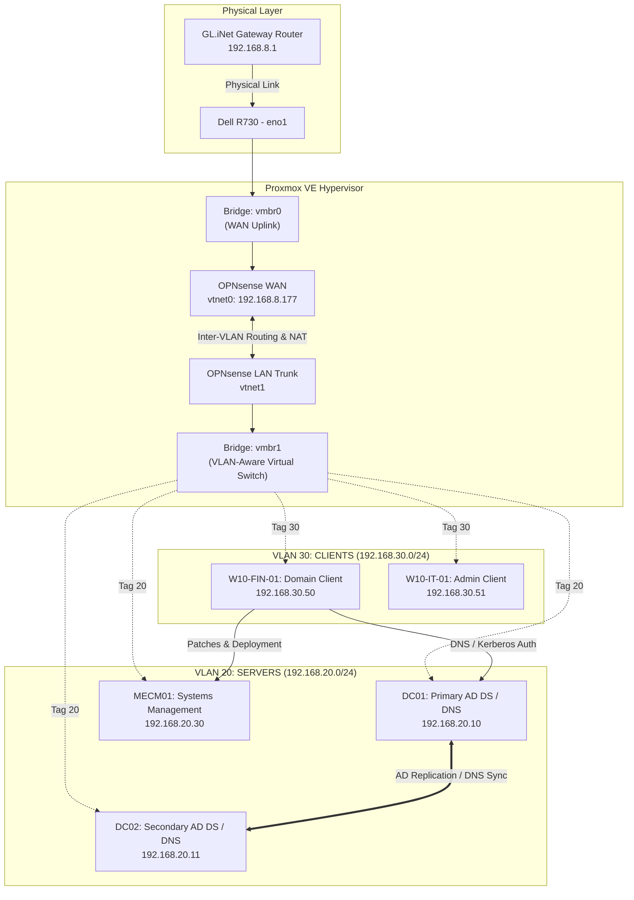

# Enterprise Virtualized Hybrid Infrastructure & Active Directory Lab


A multi-tiered enterprise homelab built on enterprise server hardware to simulate enterprise network segmentation, identity access management (IAM), systems administration, and endpoint lifecycle management.

---

## 🏗️ Architecture Overview

> 📄 *For the standalone document and breakdown, see [diagram.md](diagram.md).*



---

## 🌐 Network Segmentation Plan

| VLAN ID | Subnet | Name | Description |
| :--- | :--- | :--- | :--- |
| **VLAN 1** | `192.168.8.0/24` | **WAN / Uplink** | Physical gateway network connected via GL.iNet router |
| **VLAN 10** | `192.168.10.0/24`| **MGMT** | Out-of-band hypervisor & infrastructure management |
| **VLAN 20** | `192.168.20.0/24`| **SERVERS** | Tier-0 Core Services (Active Directory, DNS, MECM) |
| **VLAN 30** | `192.168.30.0/24`| **CLIENTS** | Enterprise client workstations & test environments |
| **VLAN 40** | `192.168.40.0/24`| **SEC / SOC** | Monitoring, SIEM (Security Onion / Wazuh), & IDS |

---

## 💻 Infrastructure Hosts & Roles

| Hostname | Role | IP Address | OS / Specs |
| :--- | :--- | :--- | :--- |
| **`OPNsense-FW`** | Core Gateway / Routing / DHCP | `192.168.20.1`, `192.168.30.1` | FreeBSD / OPNsense |
| **`DC01`** | Primary Domain Controller / DNS / FSMO | `192.168.20.10` | Windows Server 2022 |
| **`DC02`** | Secondary DC / Redundant DNS / HA | `192.168.20.11` | Windows Server 2022 |
| **`MECM01`** | Endpoint Management / WSUS / SQL | `192.168.20.30` | Windows Server 2022 |
| **`W10-FIN-01`** | Domain-Joined Workstation | `192.168.30.50` (DHCP) | Windows 10/11 Enterprise |

---

## ⚙️ Key Technical Implementations

### 1. Layer 2/3 Virtual Networking & Routing
- Configured Linux bridge `vmbr1` on Proxmox with **802.1Q VLAN awareness** (`bridge-vlan-aware yes`).
- Implemented virtual trunking into OPNsense with isolated sub-interfaces (`vlan0.20`, `vlan0.30`).
- Configured dynamic address allocation via **Kea DHCP / ISC DHCP** with custom DNS options pointing to internal Domain Controllers.
- Configured Hybrid Outbound NAT and strict inter-VLAN firewall rules allowing necessary Active Directory RPC, Kerberos, DNS, and LDAP ports.

### 2. Active Directory Domain Services (AD DS)
- Deployed a multi-domain forest (`lab.local`) with hierarchical Organizational Unit (OU) structure following enterprise RBAC standards.
- Configured active multi-master AD DS replication and integrated DNS zones with secondary resolvers.
- Automated user lifecycle onboarding, group memberships, and account unlock procedures using PowerShell.

### 3. Group Policy Architecture
- Centralized security configurations using Group Policy Objects (GPOs):
  - Standardized mapped network drives (`Z:\SharedFiles`) targeted via Security Group Filtering.
  - Windows Defender firewall policy enforcement and local administrator password restrictions (LAPS).
  - Software Update Point redirection targeting internal WSUS/MECM infrastructure.

---

## 🛠️ Verification & Troubleshooting Runbook

### Active Directory Health Checks
```powershell
# Verify domain controller replication
repadmin /replsummary
repadmin /showrepl

# Verify active FSMO role holders
netdom query fsmo

# Test secure channel from client workstation
Test-ComputerSecureChannel -Verbose
```

### Client Diagnostics & Group Policy
```cmd
:: Force GPO policy synchronization
gpupdate /force

:: Generate GPO diagnostic results summary
gpresult /r

:: Flush DNS resolver cache
ipconfig /flushdns
```
